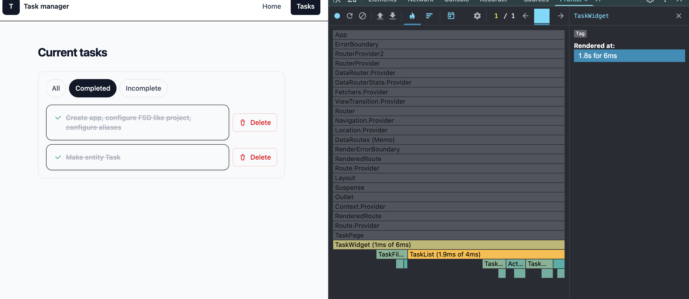
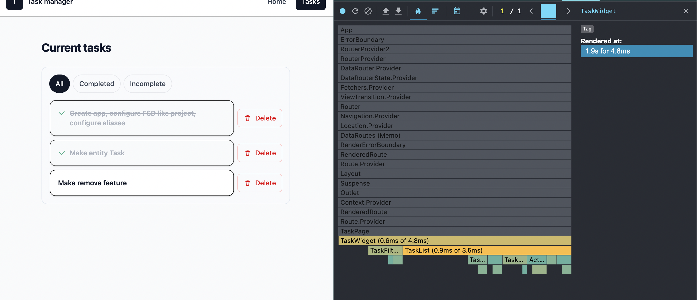
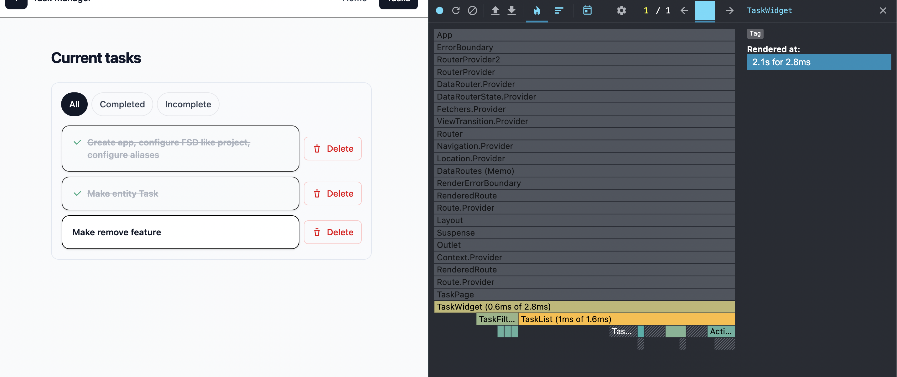

# Practice Task Manager (React + TypeScript + FSD + Tailwind)

Mini project for practicing **React application architecture** using **Feature-Sliced Design (FSD)**.

The app renders a small **task manager** with:
- tasks list
- status filtering: **All / Completed / Incomplete**
- task deletion (no reload)
- basic navigation (**Home**, **Tasks**)

---

## Tech stack

- **React 19**
- **TypeScript**
- **Vite 7**
- **React Router 7**
- **Tailwind CSS v4** (via `@tailwindcss/vite`)
- **ESLint** (with `eslint-plugin-boundaries` to enforce FSD layer imports)
- **Prettier** + `prettier-plugin-tailwindcss` (keeps Tailwind class order consistent)

---

## Requirements

- **Node.js 20.19+ or 22.12+** (Vite 7 requirement).  
  See the Vite 7 release notes / migration guide.

---

## Getting started

```bash
npm install
npm run dev
```

## Optimization tasks

### 1. `React.memo` для `TaskCard` / `TrashIcon`

`TaskCard` / `TrashIcon` обернут в `React.memo`

- Если `TaskCard` / `TrashIcon` получает те же пропсы с предыдущего рендера Реакт может пропустить ререндер компонента
- Это полезно тогда когда родительский компонент перередерился но карточка задачи не перрендерилась (видно в примере скриншотов профайлера)


### 2. `useMemo` для отфильтрнованных задач

- Пересчитывает данные при изменении `allTasks`
- Пересчитывает данные при изменении `filter`
- Не возвращает устаревшие данные после удаления задачи


### 3. `useCallback` для `removeTask`

`removeTask` обернут в `useCallback`.

- ссылка на функцию остается стабильной
- дочерние компоненты могут получать одну и ту же ссылку на обратный вызов вместо новой каждый раз


## React DevTools Profiler analysis

```text
docs/profiler/
```

### Screenshots before and after

#### Filter
1. 
2. 
#### Delete
3. 
4. 
